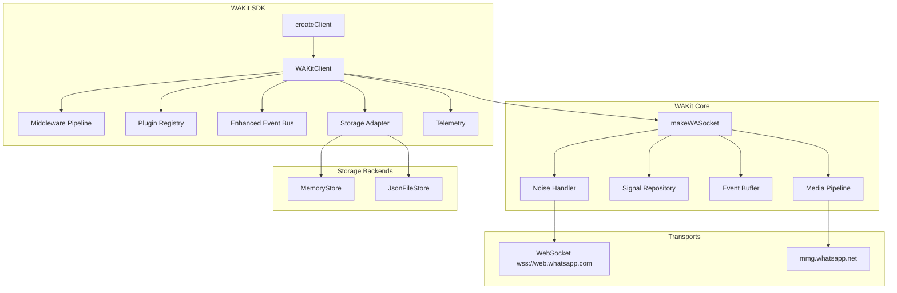
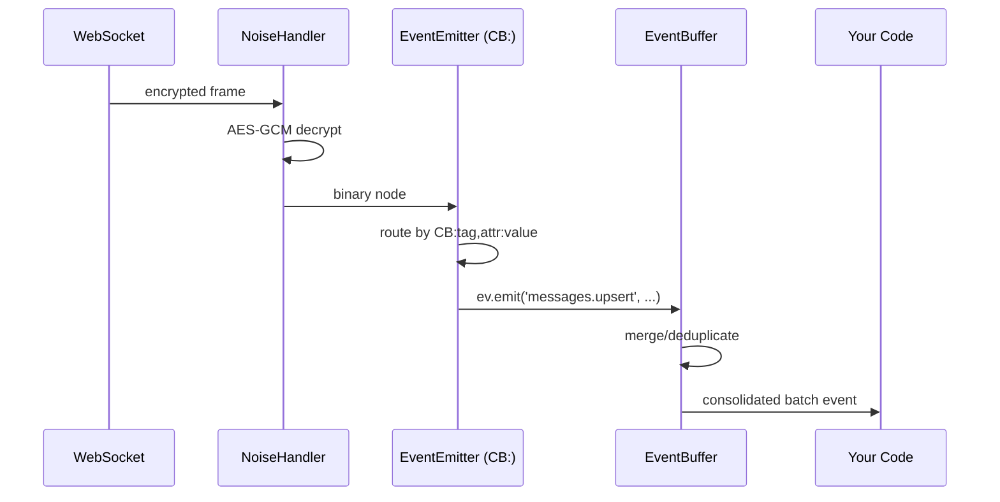
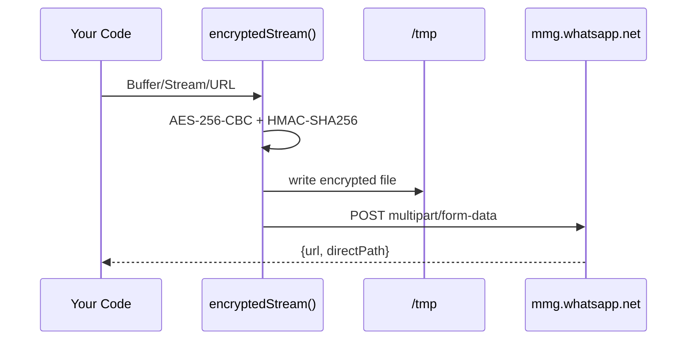

# WAKit Architecture Guide

WAKit is a production-grade TypeScript WebSocket client for the WhatsApp Web protocol built on top of WAKit.

## System Overview



## Socket Composition Chain

The WAKit socket is built as a chain of closures, each adding a capability layer:

```
makeWASocket
  └─ makeCommunitiesSocket     ← community & linked groups
        └─ makeGroupsSocket    ← group management
              └─ makeChatsSocket ← chats, labels, presence
                    └─ makeMessagesRecvSocket ← decrypt, retry, ack
                          └─ makeMessagesSendSocket ← send, media upload
                                └─ makeBusinessSocket ← business profiles
                                      └─ makeSocket  ← WS + Noise + IQ + pre-keys
```

WAKitClient wraps `makeWASocket` transparently — all underlying socket APIs are accessible via `client.socket`.

## Wire Protocol

WhatsApp Web uses a custom binary protocol:

1. **Transport**: WebSocket over TLS (wss://web.whatsapp.com/ws/chat)
2. **Handshake**: Noise_XX_25519_AESGCM_SHA256 — generates shared transport keys
3. **Framing**: 3-byte big-endian length prefix + AES-GCM encrypted payload
4. **Content**: WhatsApp binary node format (dictionary-compressed tag tree)
5. **Application**: Protobuf messages (`WAProto/WAProto.proto`)

## Event Pipeline



The `EventBuffer` batches high-volume events (e.g., 1000+ history messages) into single coalesced events, dramatically reducing processing overhead.

## Signal Protocol

WAKit uses Signal Protocol (X3DH + Double Ratchet) for end-to-end encryption:

- **Unicast**: `libsignal` SessionCipher per JID
- **Group**: Signal Sender Key Distribution (SKDM) via GroupCipher
- **LID/PN mapping**: Transparent session migration when contacts switch from phone-number to linked-device addressing
- **Transactions**: `AsyncLocalStorage` isolation prevents concurrent Signal state corruption

## Media Pipeline



Encryption is streamed to avoid loading large files into memory. Downloads use a Transform stream with AES-256-CBC decryption.

## New WAKit Modules

| Module | Location | Purpose |
|--------|----------|---------|
| `WAKitClient` | `src/client/` | Fluent wrapper with plugins, middleware, auto-reconnect |
| `createClient` | `src/client/` | Zero-config entry point |
| `Middleware` | `src/Middleware/` | Composable message processing pipelines |
| `Plugins` | `src/Plugins/` | First-class plugin lifecycle management |
| `Storage` | `src/Storage/` | Pluggable auth/signal/chat persistence |
| `Telemetry` | `src/Telemetry/` | OpenTelemetry-compatible observability interface |
| `CircuitBreaker` | `src/Utils/circuit-breaker.ts` | Three-state reliability engine |
| `wrapEventBus` | `src/Utils/event-bus.ts` | Event replay, filter, recording |
